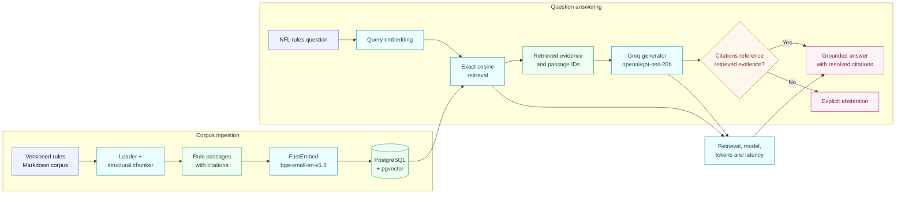

# TraceRAG

TraceRAG is an open-source, evidence-first NFL rules explainer. It resolves questions and play
scenarios against a versioned rules corpus while exposing its retrieved evidence, citations,
quality metrics, latency, and cost.

The core keeps retrieval mechanics explicit and measurable. Framework integrations, including
LangChain, remain replaceable adapters and are evaluated against the same benchmark.

## Current status

Milestone 1 is in progress. The repository currently provides:

- A typed FastAPI service with a health endpoint
- PostgreSQL 17 with the pgvector extension
- Reproducible Python dependencies through uv
- A smoke test and GitHub Actions workflow
- A versioned 2026 NFL rules corpus with authoritative rule references
- Deterministic Markdown ingestion and structural chunking
- Local `BAAI/bge-small-en-v1.5` embeddings through FastEmbed
- Exact cosine retrieval through PostgreSQL and pgvector
- A corpus status endpoint
- Grounded answer generation through Groq and `openai/gpt-oss-20b`
- Server-resolved citations and explicit abstention for unsupported rulings
- Retrieval, model, token-usage, and latency traces in answer responses
- A milestone-based [delivery roadmap](docs/roadmap.md)

Retrieval remains available as an independent endpoint so its quality can be evaluated separately
from answer generation.

## Local development

Prerequisites:

- Docker with Compose
- [uv](https://docs.astral.sh/uv/getting-started/installation/)

Install dependencies and run the tests:

```bash
uv sync
uv run pytest
```

The first embedding operation downloads an approximately 67 MB quantized ONNX model into the
configured cache directory.

Start the complete local stack:

```bash
cp .env.example .env
# Set TRACERAG_GROQ_API_KEY in .env.
docker compose up --build
```

In another terminal, index the corpus. The operation is idempotent and updates changed chunks while
removing stale chunks from the active corpus season:

```bash
docker compose exec api tracerag-index
```

Then open:

- Health check: <http://localhost:8000/health>
- Corpus status: <http://localhost:8000/corpus/status>
- Interactive API documentation: <http://localhost:8000/docs>

Retrieve evidence without generating an answer:

```bash
curl -X POST http://localhost:8000/retrieval/search \
  -H 'Content-Type: application/json' \
  -d '{"question":"What makes a sideline catch complete?","top_k":3}'
```

Generate a grounded ruling with citations and its execution trace:

```bash
curl -X POST http://localhost:8000/answers \
  -H 'Content-Type: application/json' \
  -d '{"question":"What makes a sideline catch complete?","top_k":3}'
```

The generator receives passage identifiers and text, but not authority to create citation
metadata. TraceRAG resolves every cited identifier against the retrieved passages and abstains if
the model references evidence that was not retrieved. `TRACERAG_GROQ_API_KEY` is required only for
the answer endpoint; health, corpus, indexing, and retrieval operations remain local.

Stop the services with `docker compose down`. The PostgreSQL data remains in the named Docker
volume between restarts.

## Initial architecture



The components will communicate through small project-owned interfaces. Provider and framework
integrations—including LangChain—will remain replaceable adapters.

The baseline performs exact nearest-neighbor search. Approximate vector indexes are intentionally
deferred until corpus size and measured latency justify their recall trade-off.

## Corpus scope

The initial corpus contains original explanations of selected rules in effect for the 2026 NFL
season. Each document records its season, official rule references, and authoritative source URL.
The official rulebook is linked rather than redistributed.

The assistant is designed to explain NFL playing rules. Team news, player statistics, fantasy
advice, college rules, and live officiating decisions are outside its scope.

## Engineering principles

- Evaluate retrieval separately from answer generation.
- Prefer explicit evidence and abstention over plausible unsupported answers.
- Add complexity only when a benchmark demonstrates its value.
- Keep ingestion reproducible and the evaluation corpus version-controlled.
- Track quality, latency, and inference usage together.

## Documentation sources used by the scaffold

- [FastAPI first steps](https://fastapi.tiangolo.com/tutorial/first-steps/)
- [FastAPI testing](https://fastapi.tiangolo.com/tutorial/testing/)
- [Python `pyproject.toml` guide](https://packaging.python.org/en/latest/guides/writing-pyproject-toml/)
- [Pydantic settings](https://docs.pydantic.dev/latest/concepts/pydantic_settings/)
- [uv project guide](https://docs.astral.sh/uv/guides/projects/)
- [uv Docker integration](https://docs.astral.sh/uv/guides/integration/docker/)
- [Docker Compose startup ordering](https://docs.docker.com/compose/how-tos/startup-order/)
- [pgvector](https://github.com/pgvector/pgvector)
- [FastEmbed](https://qdrant.github.io/fastembed/Getting%20Started/)
- [`BAAI/bge-small-en-v1.5`](https://huggingface.co/BAAI/bge-small-en-v1.5)
- [Groq Python SDK](https://github.com/groq/groq-python)
- [Groq structured outputs](https://console.groq.com/docs/structured-outputs)
- [Groq API reference](https://console.groq.com/docs/api-reference)
- [2026 NFL Rulebook](https://operations.nfl.com/rules-officiating/2026-nfl-rulebook)
