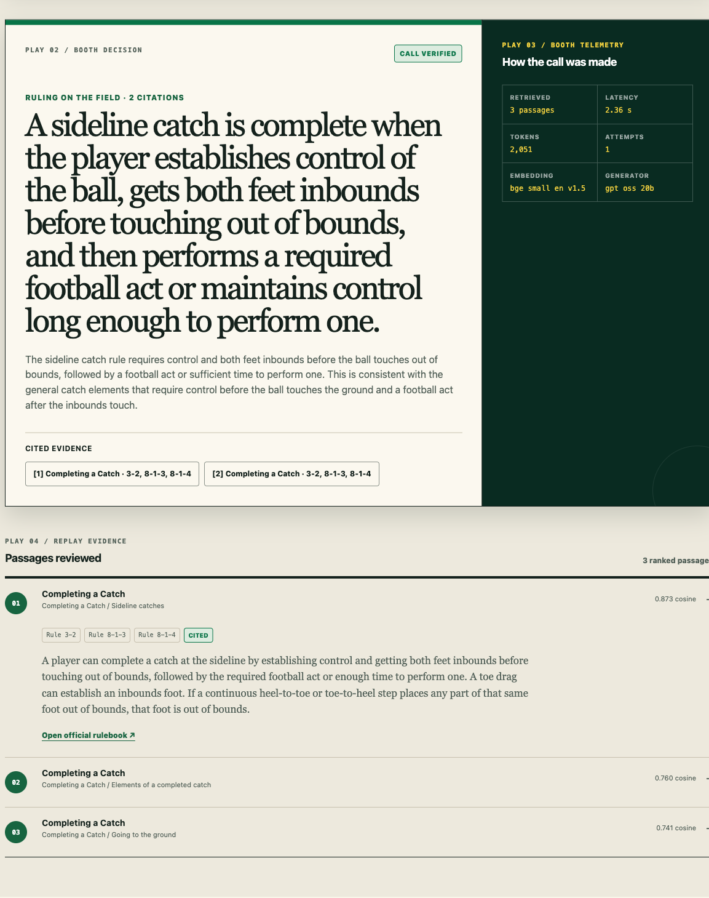
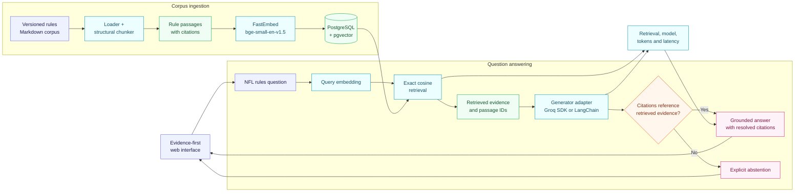
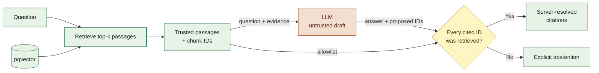

# TraceRAG

TraceRAG is an open-source, evidence-first NFL rules explainer. It resolves questions and play
scenarios against a versioned rules corpus while exposing its retrieved evidence, citations,
quality metrics, latency, and cost.

The core keeps retrieval mechanics explicit and measurable. Framework integrations, including
LangChain, remain replaceable adapters and are evaluated against the same benchmark.

## Interface

The browser experience frames each question as a play under review while keeping corpus scope and
retrieval behavior visible.


A supported ruling shows the model's answer beside execution telemetry, then exposes the ranked
passages and identifies which ones were accepted as citations.



## Features

TraceRAG currently provides:

- A typed FastAPI service with a health endpoint
- PostgreSQL 17 with the pgvector extension
- Reproducible Python dependencies through uv
- A smoke test and GitHub Actions workflow
- A versioned 2026 NFL rules corpus with authoritative rule references
- Deterministic Markdown ingestion and structural chunking
- Local `BAAI/bge-small-en-v1.5` embeddings through FastEmbed
- Exact cosine retrieval through PostgreSQL and pgvector
- A corpus status endpoint
- Grounded answer generation through Groq and `openai/gpt-oss-20b`
- Replaceable direct-SDK and LangChain generation adapters
- Targeted recovery from intermittent structured-output validation failures
- Server-resolved citations and explicit abstention for unsupported rulings
- Retrieval, model, token-usage, and latency traces in answer responses
- A versioned evaluation set with retrieval, abstention, citation, latency, and usage metrics
- A responsive evidence-first web interface served by the API

Retrieval remains available as an independent endpoint so its quality can be evaluated separately
from answer generation.

## Local development

Prerequisites:

- Docker with Compose
- [uv](https://docs.astral.sh/uv/getting-started/installation/)

Install dependencies and run the tests:

```bash
uv sync
uv run pytest
```

The first embedding operation downloads an approximately 67 MB quantized ONNX model into the
configured cache directory.

Start the complete local stack:

```bash
cp .env.example .env
# Set TRACERAG_GROQ_API_KEY in .env.
docker compose up --build
```

In another terminal, index the corpus. The operation is idempotent and updates changed chunks while
removing stale chunks from the active corpus season:

```bash
docker compose exec api tracerag-index
```

Then open:

- Web interface: <http://localhost:8000/>
- Health check: <http://localhost:8000/health>
- Corpus status: <http://localhost:8000/corpus/status>
- Interactive API documentation: <http://localhost:8000/docs>

Retrieve evidence without generating an answer:

```bash
curl -X POST http://localhost:8000/retrieval/search \
  -H 'Content-Type: application/json' \
  -d '{"question":"What makes a sideline catch complete?","top_k":3}'
```

Generate a grounded ruling with citations and its execution trace:

```bash
curl -X POST http://localhost:8000/answers \
  -H 'Content-Type: application/json' \
  -d '{"question":"What makes a sideline catch complete?","top_k":3}'
```

The generator receives passage identifiers and text, but not authority to create citation
metadata. TraceRAG resolves every cited identifier against the retrieved passages and abstains if
the model references evidence that was not retrieved. `TRACERAG_GROQ_API_KEY` is required only for
the answer endpoint; health, corpus, indexing, and retrieval operations remain local.

Generation defaults to the model's `medium` reasoning effort. It can be changed with
`TRACERAG_GENERATION_REASONING_EFFORT`, while
`TRACERAG_GENERATION_STRUCTURED_OUTPUT_RETRIES` controls the narrow retry budget for provider JSON
validation failures. Successful answer traces expose `generation_attempts`; exhausted provider
errors remain HTTP 502 responses rather than being converted into abstentions.

### Comparing the generation adapters

The direct Groq SDK remains the default. To run the same pipeline through LangChain instead, set
the backend before starting the stack:

```bash
TRACERAG_GENERATION_BACKEND=langchain docker compose up --build
```

Both adapters use the same model, system prompt, retrieved passages, output schema, retry budget,
and server-side citation verification. This isolates the framework as the comparison variable. See
the [LangChain comparison](docs/langchain-comparison.md) for the design rationale and benchmark
commands.

## Evaluation

Run the deterministic retrieval benchmark against the indexed corpus:

```bash
docker compose exec api tracerag-evaluate --top-k 5
```

The report includes hit rate, recall, reciprocal rank, and a result for every evaluation case.
Unsupported questions are excluded from retrieval relevance metrics because they intentionally have
no expected supporting document. Cases are tagged by scenario type, and the report includes the
same aggregate metrics per tag.

Compare retrieval depth in one local run:

```bash
docker compose exec api tracerag-evaluate --top-k-sweep 1 3 5
```

Answer generation is intentionally unavailable during a sweep so the command cannot accidentally
multiply provider usage.

Answer evaluation is optional because it calls the configured generation provider once per case:

```bash
docker compose exec api tracerag-evaluate --top-k 5 --answers
```

That mode additionally measures abstention accuracy, citation-document precision, grounded-ruling
accuracy, latency, and token usage. Citation-document precision verifies that citations point to the
expected rule explanation; it does not claim that every generated sentence is entailed by that
document. See the published [evaluation baseline](docs/evaluation.md) for current results and
limitations.

Stop the services with `docker compose down`. The PostgreSQL data remains in the named Docker
volume between restarts.

## Architecture


```mermaid
flowchart LR
    ui["Evidence-first<br/>web interface"]

    subgraph Ingestion["Corpus ingestion"]
        docs["Versioned rules<br/>Markdown corpus"] --> parser["Loader +<br/>structural chunker"]
        parser --> chunks["Rule passages<br/>with citations"]
        chunks --> embed["FastEmbed<br/>bge-small-en-v1.5"]
        embed --> store[("PostgreSQL<br/>+ pgvector")]
    end

    subgraph Query["Question answering"]
        question["NFL rules question"] --> qembed["Query embedding"]
        qembed --> retrieve["Exact cosine<br/>retrieval"]
        retrieve --> evidence["Retrieved evidence<br/>and passage IDs"]
        evidence --> generator["Generator adapter<br/>Groq SDK or LangChain"]
        generator --> validate{"Citations reference<br/>retrieved evidence?"}
        validate -->|Yes| answer["Grounded answer<br/>with resolved citations"]
        validate -->|No| abstain["Explicit abstention"]
    end

    ui --> question
    answer --> ui
    abstain --> ui
    store --> retrieve
    retrieve --> trace["Retrieval, model,<br/>tokens and latency"]
    generator --> trace
    trace --> answer

    classDef source fill:#eef2ff,stroke:#6366f1,color:#1e1b4b
    classDef process fill:#ecfeff,stroke:#0891b2,color:#164e63
    classDef data fill:#f0fdf4,stroke:#16a34a,color:#14532d
    classDef decision fill:#fff7ed,stroke:#ea580c,color:#7c2d12
    classDef outcome fill:#fdf2f8,stroke:#db2777,color:#831843

    class ui,docs,question source
    class parser,embed,qembed,retrieve,generator,trace process
    class chunks,store,evidence data
    class validate decision
    class answer,abstain outcome
```

### Grounding and citation trust boundary

The generator is allowed to propose an answer and cite passage IDs, but it never creates trusted
citation metadata. The application treats the retrieved passage IDs as an allowlist and resolves
the final source titles, rule references, and URLs itself.


```mermaid
flowchart LR
    question["Question"] --> retrieval["Retrieve top-k passages"]
    store[("pgvector")] --> retrieval
    retrieval --> evidence["Trusted passages<br/>+ chunk IDs"]
    evidence -->|"question + evidence"| llm["LLM<br/>untrusted draft"]
    llm -->|"answer + proposed IDs"| verifier{"Every cited ID<br/>was retrieved?"}
    evidence -->|"allowlist"| verifier
    verifier -->|"Yes"| citations["Server-resolved<br/>citations"]
    verifier -->|"No"| abstention["Explicit abstention"]

    classDef trusted fill:#e8f3e8,stroke:#176440,color:#14211c
    classDef untrusted fill:#f3dfcf,stroke:#a84b1d,color:#54200f
    classDef decision fill:#fff5c2,stroke:#9b7a00,color:#3b3100
    class question,retrieval,store,evidence,citations,abstention trusted
    class llm untrusted
    class verifier decision
```

The components will communicate through small project-owned interfaces. Provider and framework
integrations—including LangChain—will remain replaceable adapters.

The baseline performs exact nearest-neighbor search. Approximate vector indexes are intentionally
deferred until corpus size and measured latency justify their recall trade-off.

## Corpus scope

The initial corpus contains original explanations of selected rules in effect for the 2026 NFL
season. Each document records its season, official rule references, and authoritative source URL.
The official rulebook is linked rather than redistributed.

The assistant is designed to explain NFL playing rules. Team news, player statistics, fantasy
advice, college rules, and live officiating decisions are outside its scope.

## Engineering principles

- Evaluate retrieval separately from answer generation.
- Prefer explicit evidence and abstention over plausible unsupported answers.
- Add complexity only when a benchmark demonstrates its value.
- Keep ingestion reproducible and the evaluation corpus version-controlled.
- Track quality, latency, and inference usage together.

## Documentation sources used by the scaffold

- [FastAPI first steps](https://fastapi.tiangolo.com/tutorial/first-steps/)
- [FastAPI testing](https://fastapi.tiangolo.com/tutorial/testing/)
- [Python `pyproject.toml` guide](https://packaging.python.org/en/latest/guides/writing-pyproject-toml/)
- [Pydantic settings](https://docs.pydantic.dev/latest/concepts/pydantic_settings/)
- [uv project guide](https://docs.astral.sh/uv/guides/projects/)
- [uv Docker integration](https://docs.astral.sh/uv/guides/integration/docker/)
- [Docker Compose startup ordering](https://docs.docker.com/compose/how-tos/startup-order/)
- [pgvector](https://github.com/pgvector/pgvector)
- [FastEmbed](https://qdrant.github.io/fastembed/Getting%20Started/)
- [`BAAI/bge-small-en-v1.5`](https://huggingface.co/BAAI/bge-small-en-v1.5)
- [Groq Python SDK](https://github.com/groq/groq-python)
- [Groq structured outputs](https://console.groq.com/docs/structured-outputs)
- [Groq API reference](https://console.groq.com/docs/api-reference)
- [Groq OpenAI compatibility](https://console.groq.com/docs/openai)
- [LangChain model structured output](https://docs.langchain.com/oss/python/langchain/models#structured-output)
- [LangChain OpenAI integration](https://docs.langchain.com/oss/python/integrations/chat/openai)
- [2026 NFL Rulebook](https://operations.nfl.com/rules-officiating/2026-nfl-rulebook)
