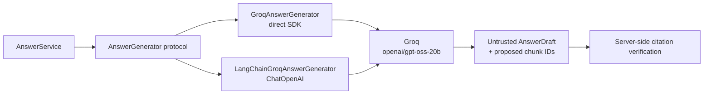

# LangChain adapter comparison

This branch adds LangChain as an alternative answer-generation adapter while preserving the direct
Groq SDK implementation. The purpose is to compare orchestration approaches without changing the
RAG system around them.

## Controlled comparison

`TRACERAG_GENERATION_BACKEND` selects the adapter:

- `groq-sdk` (default) calls Groq through its Python SDK.
- `langchain` calls the same Groq model through LangChain's `ChatOpenAI` abstraction and Groq's
  OpenAI-compatible endpoint.

Both paths receive the same question and retrieved passages and share the same:

- `openai/gpt-oss-20b` model configuration
- provider-neutral prompt builder
- Pydantic `AnswerDraft` contract
- structured-output retry budget
- token and latency accounting
- application-owned citation verification
- retrieval and answer evaluation set

The framework therefore does not own retrieval, prompt policy, citation trust, or the HTTP API. It
is one replaceable implementation of the project's `AnswerGenerator` protocol.



## Why `ChatOpenAI` targets Groq

Groq documents an OpenAI-compatible API at `https://api.groq.com/openai/v1`, and LangChain's
`ChatOpenAI` integration supports an explicit `base_url`. This lets the comparison retain the same
provider and model instead of introducing provider behavior as a second variable.

At the versions pinned for this branch, `langchain-groq` requires a pre-1.0 `groq` package while
TraceRAG uses `groq==1.7.0`. The adapter therefore uses `langchain-openai==1.6.6` rather than
downgrading the direct SDK it is meant to compare. The decision can be revisited when those package
constraints are compatible.

Relevant upstream documentation:

- [LangChain `ChatOpenAI`](https://docs.langchain.com/oss/python/integrations/chat/openai)
- [LangChain structured output](https://docs.langchain.com/oss/python/langchain/models#structured-output)
- [Groq OpenAI compatibility](https://console.groq.com/docs/openai)
- [`langchain-groq` package metadata](https://pypi.org/project/langchain-groq/)
- [`langchain-openai` package metadata](https://pypi.org/project/langchain-openai/)

## Run either adapter

The direct adapter is the default:

```bash
TRACERAG_GENERATION_BACKEND=groq-sdk docker compose up --build
```

Select LangChain with:

```bash
TRACERAG_GENERATION_BACKEND=langchain docker compose up --build
```

The API and browser interface are unchanged. `TRACERAG_GROQ_API_KEY` is required for generated
answers with either adapter.

## Benchmark both paths

Index the corpus once, then run the answer benchmark against each backend:

```bash
docker compose run --rm \
  -e TRACERAG_GENERATION_BACKEND=groq-sdk \
  api tracerag-evaluate --top-k 5 --answers > direct-sdk-results.json

docker compose run --rm \
  -e TRACERAG_GENERATION_BACKEND=langchain \
  api tracerag-evaluate --top-k 5 --answers > langchain-results.json
```

Compare these report fields:

| Dimension | Metrics |
| --- | --- |
| Answer quality | `abstention_accuracy`, `grounded_ruling_accuracy` |
| Citation quality | `citation_document_precision` |
| Reliability | Per-case errors and `generation_attempts` |
| Performance | `mean_latency_ms` |
| Usage | Input, output, and total token counts |

Retrieval metrics should be identical because adapter selection occurs after retrieval. Generated
answers may still vary between calls even with temperature set to zero, so repeated runs provide a
more useful latency and reliability comparison than a single sample.

## What LangChain adds

The adapter demonstrates LangChain's standardized model interface and schema-bound structured
output. That abstraction can reduce provider-specific integration work when multiple model backends
are required.

It also adds dependencies and another error-mapping layer. TraceRAG keeps the direct adapter because
the smaller implementation remains easy to inspect and gives the comparison a concrete baseline.
The benchmark, rather than framework preference, should determine whether the abstraction is useful
for this application.
